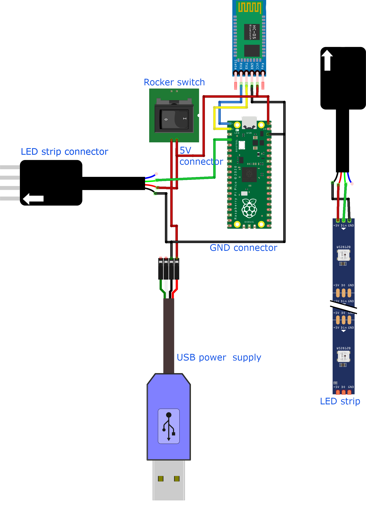

# Remote LED Strips with a Raspberry Pi Pico

Welcome to the "Remote LED Strips with a Raspberry Pi Pico" 
repository! This guide is designed to help you create a 
remotely controlled LED strip system using the powerful 
Raspberry Pi Pico microcontroller. With this project, 
you'll be able to control your LED strip from anywhere via 
Bluetooth, making it easy to create dynamic and eye-catching 
light displays.

You can find the full tutorial [here](https://diy-home.org/2023/01/20/remote-led-strips-with-a-raspberry-pi-pico/)
- how to build your device
- how to setup your Raspberry Pi Pico
- with the 3D model of the case

